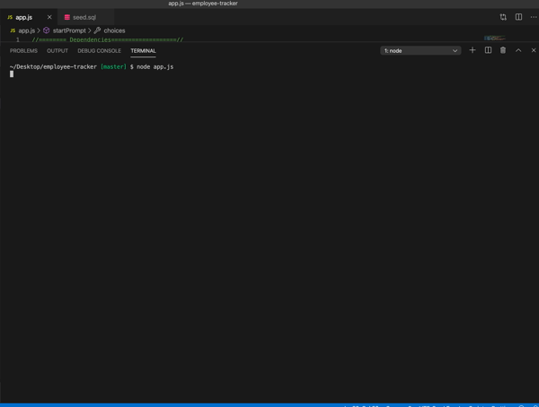

# employee-tracker

## Summary 
Employee Tracker is a CLI applicaiton for building and maintaining companies employee data base. Built on MySQL and leveraging modularity in the structure of Employee Tracker, it can scale appropriatley with a companies growth without reconfiguring the core structure of the internal employee data base. This application can act as a foundation to continue to build upon. Employee allows managers or someone within the company to view all employees, roles, as well as departments. It also allows for adding employees, roles, departments and updating employees all from your CLI.

## Demo
 

## Getting Started

### Instructions:
In order to use this application you will need to first run an npm install in your CLI to install the dependencies that have been loaded into the json files for you. Once this is done, run node app.js in your CLI to start the prompts that will walk you through the verious tasks you can perform with this application. 

 
## Technologies Used
- MySQL: Relational database management system based on SQL – Structured Query Language, used in this applicationt to warehouse and query employee and company data. 
- Express.js - Used for applicatoin end points handling client requests as well as utilizing middle ware for referencing public files in backend funcitions. 
- Node.js - Used for package managment and to execute JavaScript code outside of a browser to build command line tool for server-side scripting.
- Javascript - Used to base functionality of functions and prompts within the application.
- ES6 - Used to build prompts, functions, methods, and classes.  
- HTML - Used to generate HTML to be displayed in the browser.
- CSS - Used to style html elements.
- Git - Version control system to track changes to source code
- GitHub - Hosts repository that can be deployed to GitHub Pages
 
## Code Snippet
The following code snippet shows the schema that is the base for our link between our app.js file that oeprates the functions for building upon our employee regestry, and data base we create with this same schema setup in our sql workbench. Once these two are connected via calling upon our required mysql package and connection port and host thats configured in our JavaScript. We can then execute the functionality of the application through our JavaScript.

```sql
CREATE DATABASE employee_trackerDB;

USE employee_trackerDB;

CREATE TABLE department (
  id INT NOT NULL AUTO_INCREMENT PRIMARY KEY,
  name VARCHAR(30)
 
);

CREATE TABLE role (
  id INT NOT NULL AUTO_INCREMENT PRIMARY KEY,
  title VARCHAR(30),
  salary DECIMAL,
  department_id INT,
  FOREIGN KEY (department_id) REFERENCES department(id)
);

CREATE TABLE employee (
  id INT NOT NULL AUTO_INCREMENT PRIMARY KEY,
  first_name VARCHAR(30),
  last_name VARCHAR(30),
  manager_id INT,
  role_id INT,
  FOREIGN KEY (role_id) REFERENCES role(id),
  FOREIGN KEY (manager_id) REFERENCES employee(id)

);
});

```

## Built With
* [MySQL](https://www.mysql.com/)
* [Express.js](https://expressjs.com/)
* [Node.js](https://nodejs.org/en/)
* [npmjs](https://docs.npmjs.com/)
* [inquirer](https://www.npmjs.com/package/inquirer)

## Authors

**Chris Melby**
- [LinkedIn](https://www.linkedin.com/in/chris-melby-71106b126/)
- [Link to Github](https://github.com/cmelby)
- [Portfolio](https://cmelby.github.io/portfolio/)
